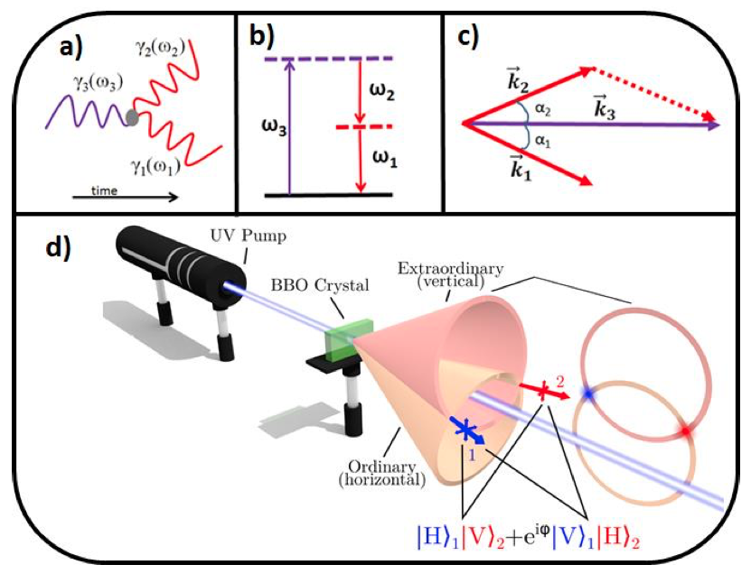

> "We know the past but cannot control it. We control the future but cannot know it." - Claude Shannon

# Connection

 \textit{Connections change the world.} Due to the limitations of human cognitive ability, the size of the naturally occurring group does not exceed 150, called Dunbar’s number[1]. But, humans in modern society live in a larger group than that. The reason why human groups can exceed the Dunbar’s number is that humans be connected to each other by sharing information[2]. 예를 들면 종교. 같은 믿음을 가진 사람들끼리는 적대하지 않고 연결될 수 있다. have the ability to have common beliefs. 처음보는 사이여도 common beliefs 를 공유하는 사이라면 적대하지 않을수 있음. 같은 정보를 공유하고 있다는 것은 사람을 연결시킨다. Mankind was able to achieve a civilization distinct from other primates by developing common beliefs. Believe or not, 'Let there be light' changed the world. 
 
 Mankind has developed a way that shares belief as well as belief itself. Gutenberg’s printing press, Marconi’s wireless telegraphy, emergence of the world wide web. Now mankind is going to connect the world using quantum entanglement. Entanglement is a unique phenomenon that only appears in quantum systems. It is possible to create new information sharing methods that have never existed before.

# Entanglement

When two or more systems link up in a certain way and cannot be described independently of the state of the others, we call it textit{Entanglement}. Entanglement is represented by kronecker product and superposition of vectos. 

Most famous entangled state is the Bell state, as follows:

$$
\ket{\Psi^+_{AB}} = \frac{1}{\sqrt{2}}(\ket{0_A1_B}+\ket{1_A0_B}) 
$$

위와 같은 벨 스테이트를 이용해 양자 정보를 전송할 수 있다. 퀀텀 텔레포테이션이라 불리는 방법이다[2]. Alice 와 Bob 이 나눠가짐. Alice 가 갖고 있는 상태 C. 우리가 보내고 싶은 양자상태 $\ket{\psi_C}=\alpha\ket{0_C}+\beta\ket{1_C}$ 라고 정의하자.

$$
\ket{\psi_C}\otimes\ket{\Psi^+} =(\alpha\ket{0_C}+\beta\ket{1_C}) \otimes(\frac{1}{\sqrt{2}}(\ket{0_A1_B}+\ket{1_A0_B})) \newline
=\frac{1}{\sqrt{2}}(\alpha\ket{0_C0_A1_B}+\alpha\ket{0_C1_A0_B}+\beta\ket{1_C0_A1_B}+\beta\ket{1_C1_A0_B})

$$
projection to $\ket{\Psi^+_{CA}}=\frac{1}{\sqrt{2}}(\ket{0_C1_A}+\ket{1_C0_A})$, then whole state is:

$$
\alpha\ket{0_B}+\beta\ket{1_B}
$$

엘리스가 CA 를 측정함으로써 C 의 양자상태를 Bob 에게 전달했음.

그럼 양자 전송의 핵심이 되는 bell state 는 어떻게 물리적으로 implementation 하는가? Spontaneous Parametric Down-Conversion(SPDC) 라고 불리는 현상을 이용한다.

# Light

SPDC is a non-linear optical process where a photon spontanously splits into two other photons of lower frequencies[3]. Two lower frequency photons satisfy the phase matching conditions:
$$
w_p = w_s+w_i\newline
\vec{k_p}=\vec{k_s}+\vec{k_i}
$$
where the subscript p refers to the \textit{pump} beam, s and i refer to ther \textit{signal} and \textit{idler} beams. The process is said to be degenerate if the down converted photons have the same free space wavelength. In general, the photons of a down-converted pair exit the crystal non-collinearly, in different directions which satisfy the phase matching condition.

H ㄹㅡㄹ ㄱㅘㄴ측하면 페이즈매칭 컨디션때문에 2번위치에 V 가 나옴. 언디스팅귀시블. 이것이 벨 스테이트임.
SPDC 의 종류 세가지. 우린 타입 2로 만들것임.
SPDC 페이즈매칭.
SPDC 로 벨스테이트 만드는 그림.

a: SPDC 의 파인만 다이어그램. b: 에너지 보존 컨디션. c: 모멘텀)웨이브벡터 보존 컨디션. d: SPDC 로 벨스테이트를 만드는 실험도. 
HV+VH 이고, H를 0으로, V를 1로 인코딩하면 위에서 언급한 벨 스테이트다. 짜잔!

 # reference

 1. dunbar 논문
 2. 하라리의 사피언스

3. Christophe Couteau (2018) Spontaneous parametric down-conversion, Contemporary Physics, 59:3, 291-304, DOI: 10.1080/00107514.2018.1488463